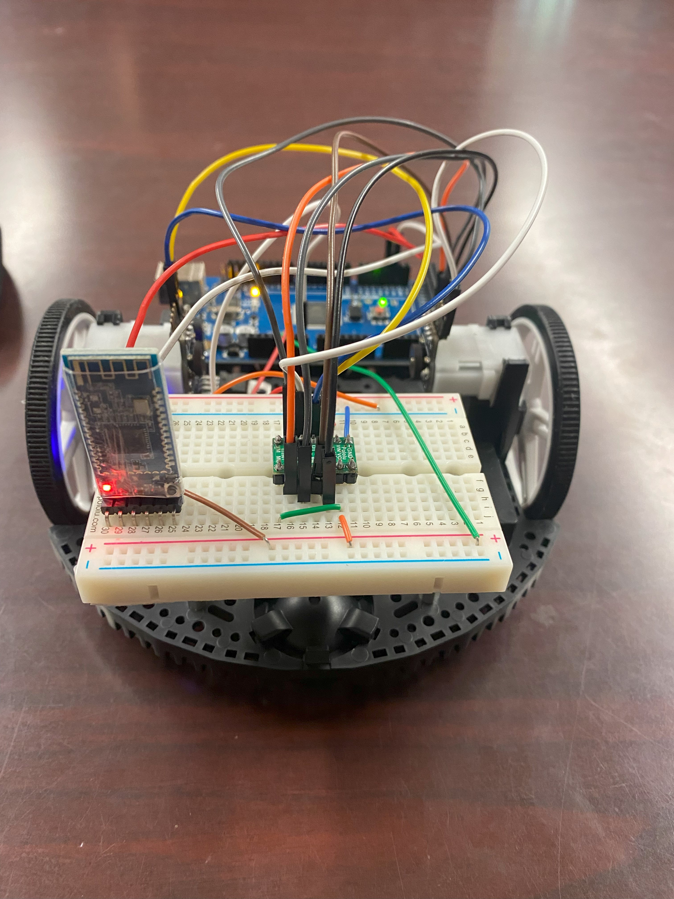
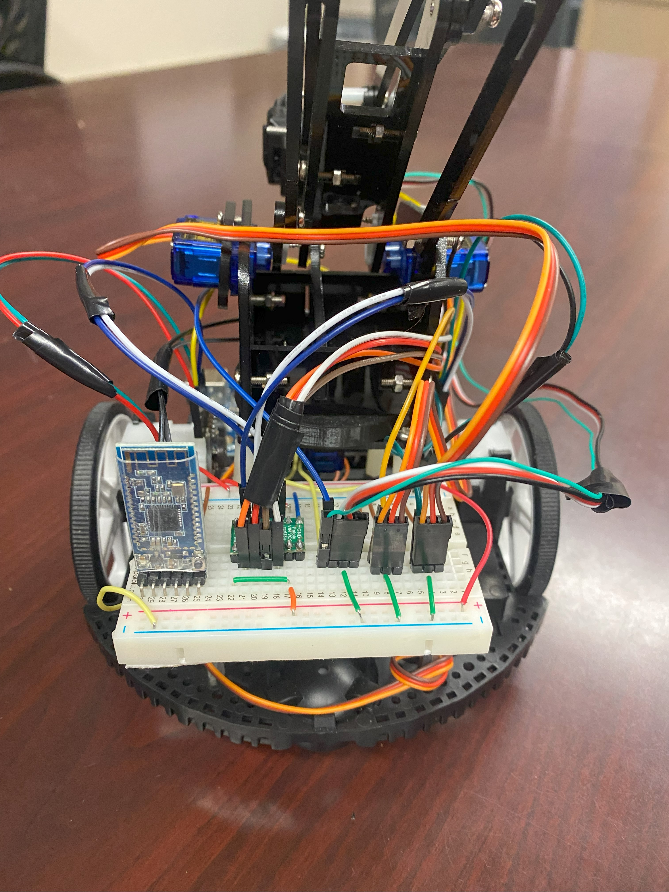

# Robotics Project Repository

  

Welcome to the Robotics Project repository! This repository houses the codebase for three exciting robotics projects that showcase the capabilities of my robot in various challenges. I developed these in college at Kansas State University. 

## Projects Overview:

### 1. Pick-and-Place Control Arm
- **Description:** This project focuses on the development of a robot equipped with a sophisticated control arm capable of picking up items. The robot was showcased in a thrilling race among peers, demonstrating its precision and agility in manipulating objects.

### 2. Line Following Race
- **Description:** In this project, our robot was challenged to complete a race in the fastest time by following a designated black line on the floor. The implementation involves advanced line-following algorithms, showcasing the robot's speed and accuracy in navigating predefined paths.

### 3. Maze Navigation Challenge
- **Description:** The third project tests the robot's ability to successfully navigate through a maze. The maze navigation challenge emphasizes the robot's decision-making capabilities and pathfinding algorithms, highlighting its adaptability and intelligence in complex environments.

## Pictures:

